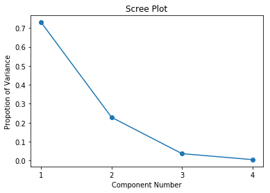

# eigpca
PCA via eigen-decomposition of the covariance/correlation matrix.

# Install
```bash
pip install eigpca
```

# Example
```python
from eigpca import PCA
from sklearn.datasets import load_iris

X = load_iris().data
pca = PCA()

pca.fit(X)
pca.transform(X, n_components=2)
```
### Scree Plot
```python
pca.plot(y="pov")
```


